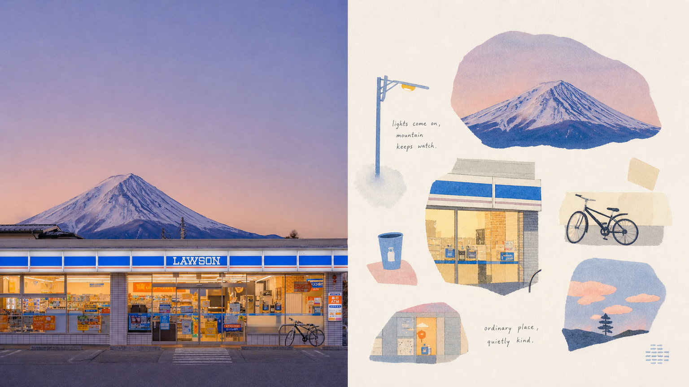
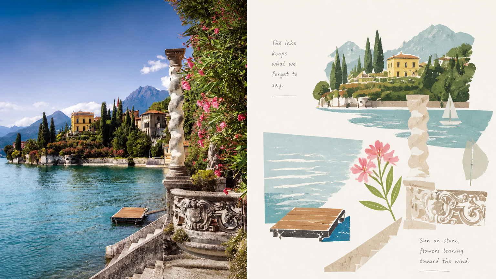
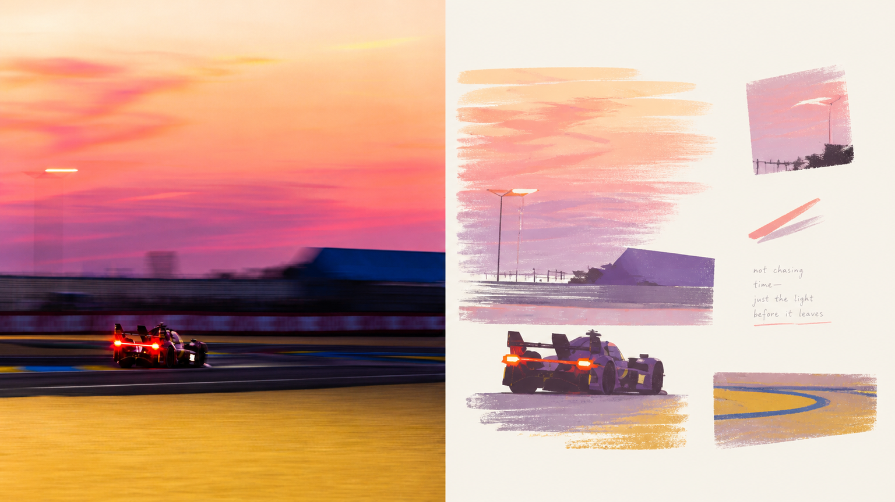
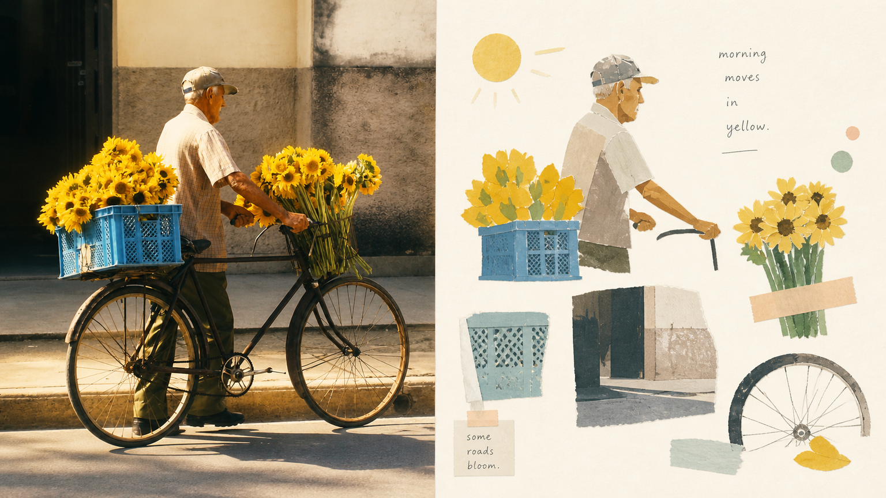
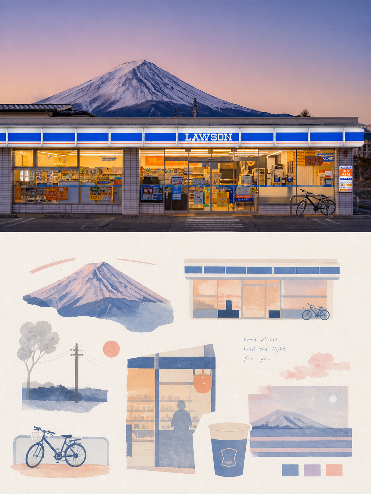
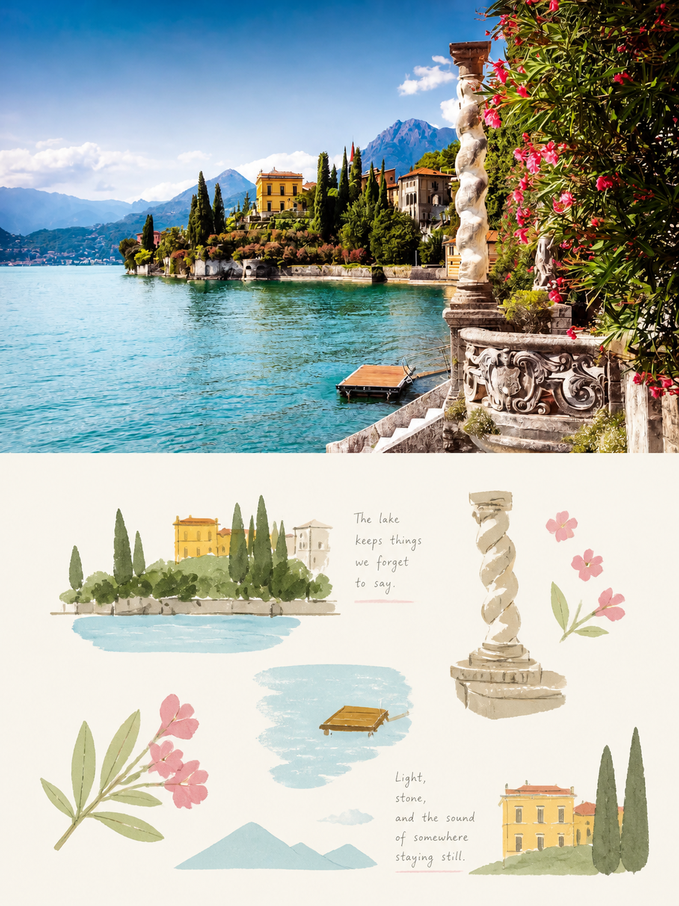
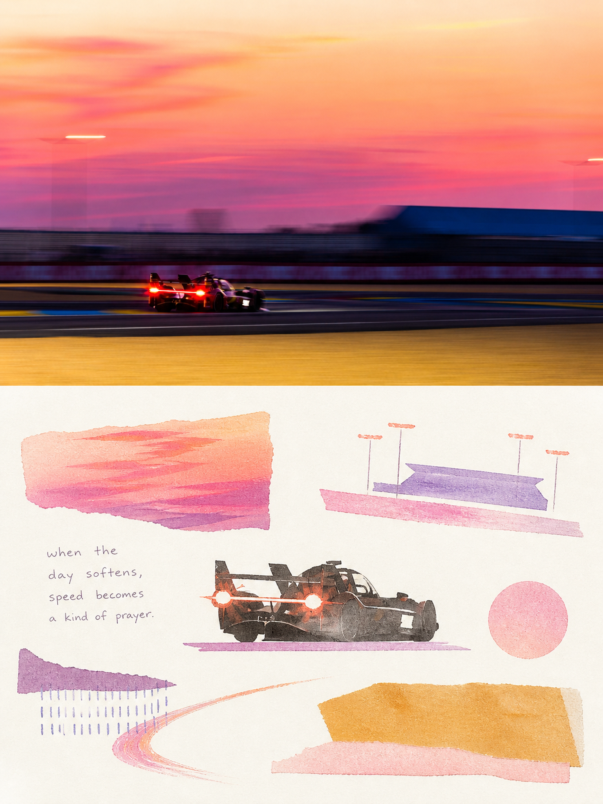
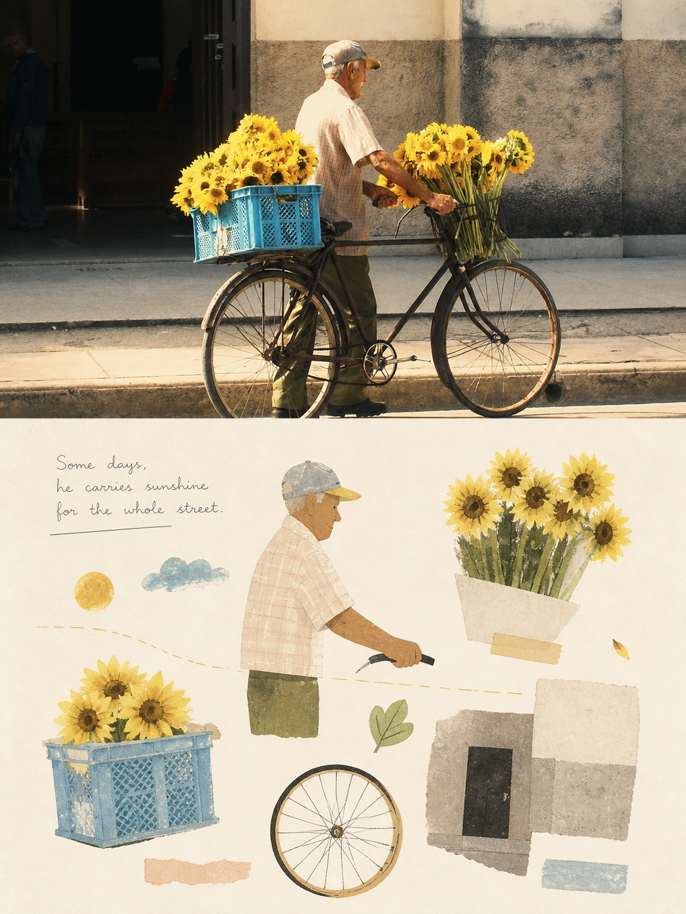

# 🦁 XXD Panel 061

### 把照片重组为散落而彼此呼应的视觉记忆片段

Panel 061 从照片中选出约 3–6 个最有意义的主体、动作、环境线索或隐喻，用剪纸、水粉、粉蜡、Risograph 与丝网印刷式平面语言，组织成一页轻盈的私人视觉日记。

**关键词：** 选择性记忆 · 多片段叙事 · 剪纸色块 · 治愈色盘 · 即兴编辑排版

## 使用

```text
/xxd-panel-061 photo.jpg --mode design-only --size 3:4 --text prompt --locale zh-CN
```

支持单图或图片目录、上下对照、左右对照、纯设计图、四端壁纸、多比例、准确像素以及三种文字模式。完整行为见 [SKILL.md](SKILL.md)。

## 提示词权威

[简体中文原始提示词](references/original-prompt/zh-CN.md)是运行时唯一创作与审美权威。Skill 只追加本次交付变量，不改写原文。

当前尚未提供原始 X 样张或出处，`sample-01`–`04` 因此保留。下面的新增样张均有明确内容源映射，详见[样张清单](assets/examples/README.md)。

## 新增 16:9 左右双联样张

| | |
|---|---|
|  |  |
|  |  |

## 新增 3:4 上下双联样张

| | |
|---|---|
|  |  |
|  |  |
